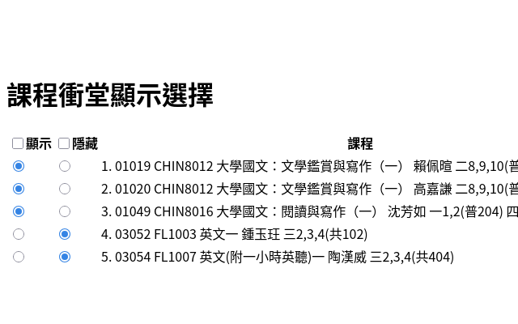

## 台大選課搜尋輔助工具 (firefox/chrome addon)

  + 在課程搜尋的結果表格的開頭增加一個衝堂/已選提示欄位，根據已經加入的課表內容來判斷
  + 滑鼠移到衝堂標籤上時會顯示衝到的課
  + 也可以切換隱藏有衝堂的課

  
  

Firefox 可以自行下載 ntu-course-search-addon.zip 安裝 (如果 browser 的 store 還沒 approve 的話)

Chrome 可以從 web store [安裝](https://chromewebstore.google.com/detail/ntu-course-search-helper/edmjohemconolnoeggicplenhhbeeebl)
